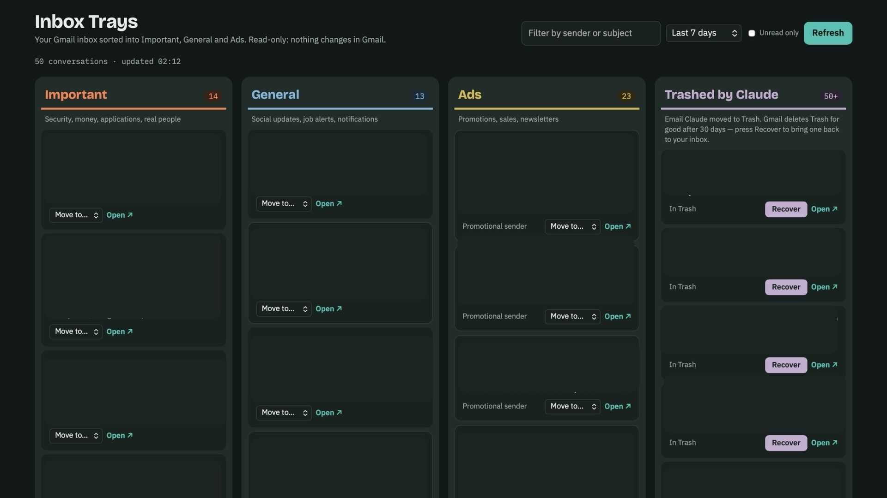

# Inbox Trays 📬

Sort your Gmail inbox into **Important**, **General** and **Ads**, clean it up with saved searches, and bring anything back with one **Recover** click.

Inbox Trays is a static web app: plain HTML, CSS and JavaScript with no build step, no server and no database. It talks to the Gmail API directly from your browser, so your email never passes through anyone else's server.



## Features

- **Four trays**
  - **Important:** security alerts, receipts, job-application replies, conversations you replied in, and email from real people.
  - **General:** social and job-site notifications.
  - **Ads:** promotions and newsletters.
  - **Cleaned up:** only the email *this app* moved to Trash, each with **Recover** and **Open** buttons.
- **Move to…:** fix any mis-sorted email. Your choice is remembered in this browser.
- **Clean up:** run a saved Gmail search (for example `from:shein`), preview what matches, then move it all to Trash in one step.
- **Safe by design**
  - Nothing is deleted permanently.
  - Every email the app trashes gets the `Inbox Trays/Cleaned` label, so it can find and recover it.
  - Gmail empties Trash after 30 days.
- **Private**
  - The Google access token is kept in memory only and is never stored.
  - There's no backend and no analytics.
- **Works on a phone:** the trays turn into tabs.
- **Thai and English** text supported.

## Quick start

You need a free Google Cloud OAuth Client ID. It takes about 5 minutes; see **[docs/google-oauth-setup.md](docs/google-oauth-setup.md)**.

```bash
git clone https://github.com/<your-username>/inbox-trays.git
cd inbox-trays

# 1. Paste your OAuth Client ID into config.js
# 2. Serve the folder on the origin you allowed in Google Cloud:
python3 -m http.server 8080        # or: npx serve -l 8080
```

Open <http://localhost:8080> and press **Sign in with Google**.

> Opening `index.html` directly from disk (`file://`) won't work. Google sign-in needs an `http://localhost` or `https://` origin.

### Deploy on GitHub Pages

1. Fork the repo, then put your Client ID in `config.js` and commit it. A Client ID is not a secret: it only works from the origins you list in Google Cloud.
2. In your fork, go to **Settings → Pages → Deploy from branch → `main` / root**.
3. Add `https://<your-username>.github.io` to **Authorized JavaScript origins** in Google Cloud.

## Configuration

Everything lives in [`config.js`](config.js):

| Setting | What it does |
| --- | --- |
| `googleClientId` | Your OAuth Client ID (Web application). |
| `cleanedLabel` | The label added to email the app trashes. The **Cleaned up** tray lists this label. |
| `cleanupRules` | Saved searches shown in **Clean up…**. Each `query` uses normal [Gmail search syntax](https://support.google.com/mail/answer/7190). |
| `sorting.importantSenders` / `adsSenders` / `generalSenders` | Extra text to match in sender addresses, added to the built-in lists. |

The sorting logic is in [`src/classify.js`](src/classify.js): plain rules, no AI, easy to read and change.

## How it works

```
Browser ──(Google Identity Services popup)──▶ access token (in memory, ~1 hour)
Browser ──(fetch + Bearer token)──▶ gmail.googleapis.com
```

- **Permission (scope):** `gmail.modify`. The app needs it to read metadata, add a label, move email to Trash and recover it. It never requests permission to permanently delete email.
- **What it reads:** only each message's From, Subject and Date headers and Gmail's short preview (`format=metadata`). It never downloads message bodies.
- **Cleaned up tray:** lists threads that have both the `TRASH` label and the app's own label.

## Project layout

```
index.html            page shell + Content-Security-Policy
config.js             your settings
src/app.js            UI
src/gmail.js          Gmail REST client + Google sign-in
src/classify.js       sorting rules (pure functions)
src/styles.css        light/dark theme
test/                 unit tests + browser smoke test (mocked Gmail)
Showcase.jpg          screenshot
docs/                 setup guide
```

## Development

```bash
npm test                              # unit tests for the sorting rules (Node 18+)
npm install && npx playwright install chromium
npm run test:browser                  # end-to-end test with Google + Gmail mocked
```

Contributions are welcome. See [CONTRIBUTING.md](CONTRIBUTING.md).

## Privacy & security

See [SECURITY.md](SECURITY.md). If you find a vulnerability, please report it privately rather than opening a public issue.

## License

[MIT](LICENSE) © 2026 Tagrid Chongkolrattanapond

Gmail is a trademark of Google LLC. This project is not affiliated with or endorsed by Google.
